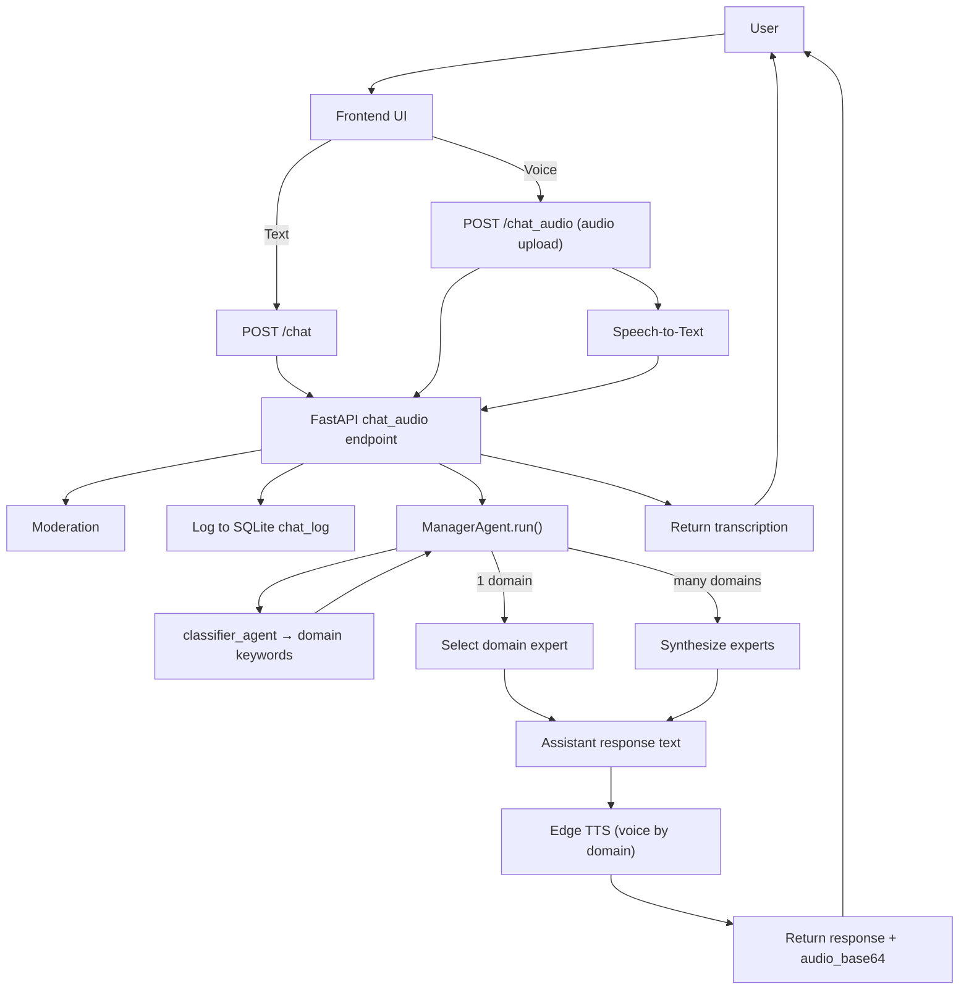

# Aurora — Multi-Agent AI Voice Assistant (Agno + FastAPI)

## Overview

Aurora is a multi-personality AI voice assistant built using the Agno framework and served through FastAPI.  
The assistant automatically understands the user's intent and responds using the most suitable conversational style, allowing natural interaction across multiple domains.

Aurora supports both text and voice interaction, maintains conversation history, and adapts its response style depending on the type of query.

The system is designed to simulate conversations with different types of assistants such as a tutor, therapist, healthcare assistant, or finance helper, while keeping the experience seamless for the user.

---

## Application Features

- Text chat support through API
- Voice input with automatic speech-to-text
- Voice responses using text-to-speech
- Automatic understanding of user intent
- Context-aware replies across multiple domains
- Emotion-aware conversational responses
- Session history stored for each user
- Simple web UI for interaction
- FastAPI backend with real-time responses
- SQLite database for chat history

Users can ask questions normally without selecting any mode manually.

---

## Voice Interaction Flow

Audio input  
→ Speech-to-Text  
→ Intent detection  
→ Expert response  
→ Text-to-Speech  
→ Audio reply

The system automatically selects the correct response style.

---

## Reference Paper

This project is based on the published research work:

Aurora: A Multi-Personality AI Voice Assistant for Domain-Specific and Emotion-Aware Interactions  
IEEE Xplore: https://ieeexplore.ieee.org/document/11294651

---

## System Behavior

Aurora dynamically detects the type of query and responds accordingly.

Possible response styles include:

- Healthcare assistant
- Tutor / educational helper
- Therapist / emotional support
- Finance assistant
- General conversation

The user does not need to select any mode manually.  
Aurora automatically decides how to respond.

For emotional conversations, the assistant may respond using different therapeutic styles such as:

- Emotional support
- Reflective dialogue
- Cognitive restructuring

These are selected automatically during runtime.

---


## Architecture (single combined flow)



---

## Setup

Clone repository

```
git clone <your_repo_url>
cd multi-agent-assistant
```

Create virtual environment

```
python -m venv venv
```

Activate environment

Windows

```
venv\Scripts\activate
```

Linux / Mac

```
source venv/bin/activate
```

Install dependencies

```
pip install -r requirements.txt
```

Create .env file in project root

```
multi-agent-assistant/.env
```

Add API key

```
GROQ_API_KEY=your_key_here
```

Important

- Do not commit .env
- Add .env to .gitignore

Example .gitignore

```
venv/
.env
__pycache__/
tmp/
```

---

## Run Server

```
uvicorn backend.main:app --reload --host 127.0.0.1 --port 8000
```

Open in browser

```
http://127.0.0.1:8000
```

---

## API Endpoints

POST /chat  
POST /chat_audio/  
GET /sessions/{user_id}  
GET /sessions/{user_id}/{session_id}/history  
PUT /sessions/{user_id}/{session_id}/name  

---

## Data Storage

Session history is stored in SQLite.

```
tmp/agent.db
```

Temporary audio files

```
tmp/audio/
```

These files are created automatically.

---

## Security Notes

- API keys stored in .env
- Do not push secrets to GitHub
- SQLite used for local development
- Audio files stored temporarily
---

## Author

Gorentla Sri Sai Meghana
